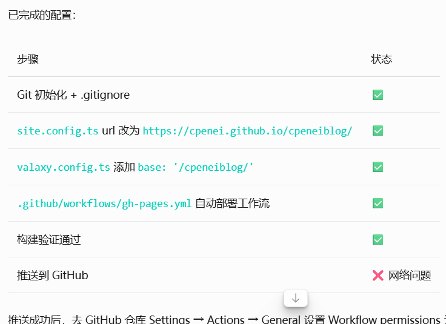

之前的博客用的hugo架构，因为嫌弃渲染麻烦弃置很久了hhh
昨天在WMU群里受到学姐启发，想试试valaxy（因为看上去比hugo厉害多了）,于是今天折腾了一个下午搞好了新的博客，这篇文章大概纪念一下（嗯
p1:本地nvm坏了，让opencode修的，顺带把node更新到22了
p2:配置文档没看懂，opencode翻译的
p3:icon挂了，挂载后自动好了我草
p4:github推送挂了，改个梯子模式（TUN?）好了
不算很折腾，额毕竟opencode即使搭载免费劳动力mimo2.5也很解放双手
全程半自动了都

额接下来大概就在这边博客写点小文章然后写点学期小阶段规划记录之类的
首先的目标是！
备战转专业！！！（我补药待在老年医学与健康啊啊啊
嗯对晚点把评论区加上（？
先写到这里，这篇文章本质也测试一下在post下面直接放图片然后引用效果如何
awa
2026-08-17