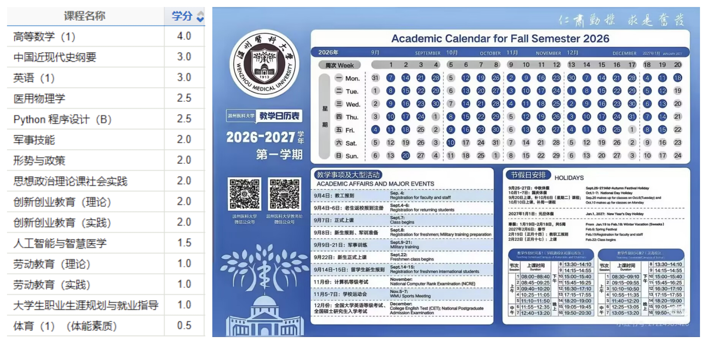

第一学期的学分和日程↓

## 学业
###### 主要目标:转专业(记得问学长学姐的建议方向!) 
### 通识课专业课
给我卷到前五！！
### 水课
记得合理安排时间 不许人云亦云
### 外语 
###### 英语先四级 日语n0.5水平先

## 艺术修养
### 次要目标/要求
搞点同人 画画做制品 补番补gal
不许摸鱼 精力低了记得歇 
社交适当 学校社团为次 个人多积累点实在的先
不许不修边幅 适当运动 减肥 按时睡觉 不许懒qwq
求监督
